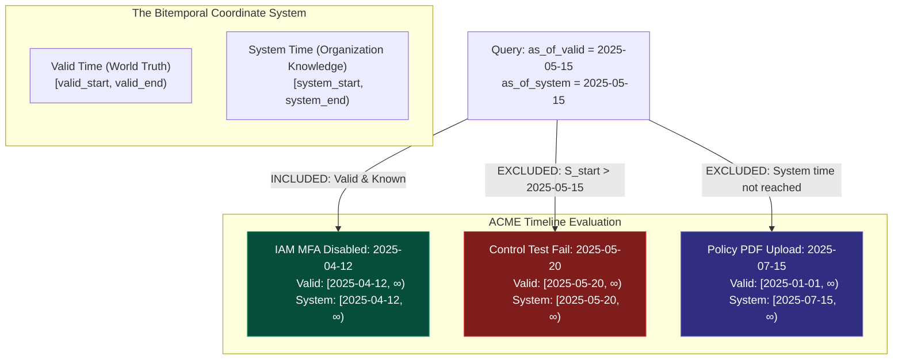
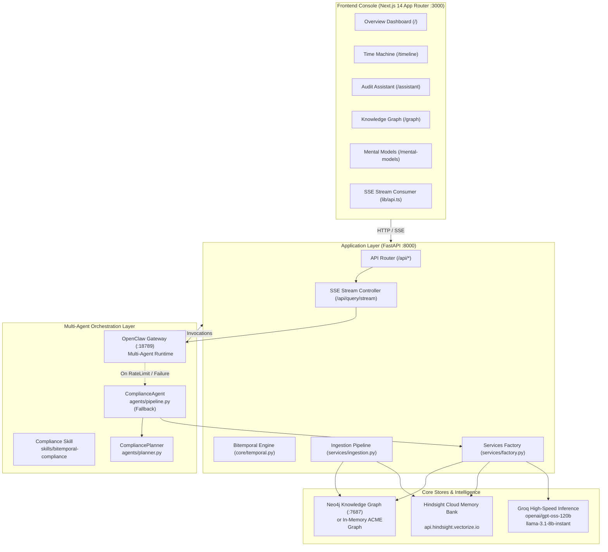
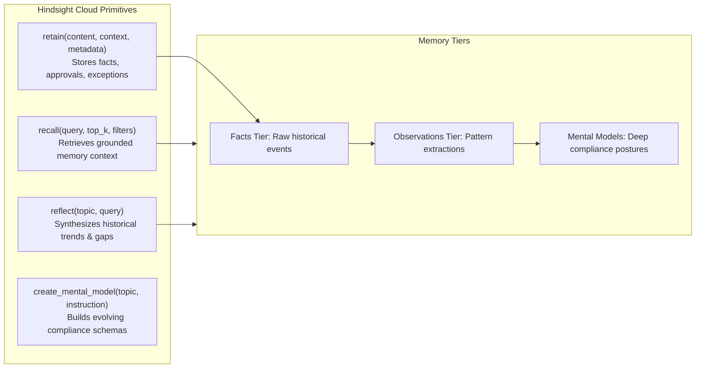
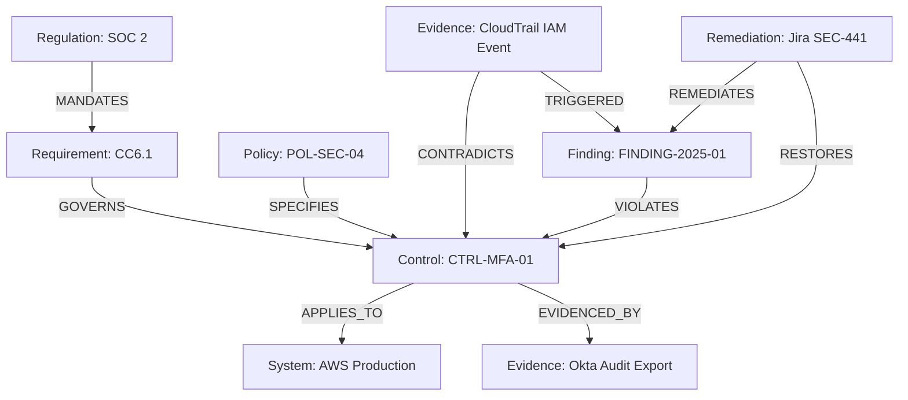

# VeriChron AI — Master Technical Architecture & Specification

> **Bitemporal Governance & Autonomous Audit Intelligence**  
> *Reconstructing what was true, what the organization knew, and why policies changed.*

---

## Table of Contents

1. [Executive Summary & Core Innovation](#1-executive-summary--core-innovation)
2. [The Bitemporal Governance Engine](#2-the-bitemporal-governance-engine)
3. [System Architecture](#3-system-architecture)
4. [Multi-Agent Orchestration (OpenClaw & ComplianceAgent)](#4-multi-agent-orchestration-openclaw--complianceagent)
5. [Long-Term Memory Architecture (Hindsight Cloud)](#5-long-term-memory-architecture-hindsight-cloud)
6. [Knowledge Graph Engine (Neo4j & In-Memory Graph)](#6-knowledge-graph-engine-neo4j--in-memory-graph)
7. [LLM Reasoning & Token Optimization (Groq)](#7-llm-reasoning--token-optimization-groq)
8. [Frontend Console Architecture](#8-frontend-console-architecture)
9. [Complete API Reference](#9-complete-api-reference)
10. [Data Ingestion & The ACME Canonical Scenario](#10-data-ingestion--the-acme-canonical-scenario)
11. [Testing & Quality Assurance](#11-testing--quality-assurance)
12. [Deployment & Operational Runbook](#12-deployment--operational-runbook)
13. [Hackathon Demo & Verification Script](#13-hackathon-demo--verification-script)
14. [Roadmap & Future Enhancements](#14-roadmap--future-enhancements)

---

## 1. Executive Summary & Core Innovation

### 1.1 The Fundamental Flaw in Modern GRC and RAG
Existing Governance, Risk, and Compliance (GRC) tools and standard Retrieval-Augmented Generation (RAG) AI systems suffer from a critical architectural defect: **temporal flattening**.

When an auditor asks:  
> *"What was our SOC 2 compliance posture on May 15, 2025?"*

Standard systems retrieve the **current snapshot** of documentation:
1. They search vector embeddings computed against the latest available PDFs and policies.
2. If an MFA policy was uploaded on July 15, 2025 stating that MFA had been mandated since January 2025, a standard RAG system incorrectly claims the organization was compliant on May 15 because the policy text matches.
3. Conversely, if a control test failed on May 20, 2025, standard RAG might leak that failure into a May 15 inquiry, even though on May 15 the organization had **no knowledge** that the control was failing.

This is known as **retroactive knowledge leakage** and **anachronistic hallucination**. In regulatory audits (SOC 2, ISO 27001, HIPAA, FedRAMP), presenting evidence that was not known or valid at the audit time is considered audit fraud or severe compliance deficiency.

### 1.2 The VeriChron Solution
VeriChron AI is the first autonomous governance engine built from the ground up on **Bitemporal Modeling**, combining:
1. **Bitemporal Logic (`valid_time` vs `system_time`)**: Decouples when an event happened in the real world from when the organization recorded it in its systems.
2. **Typed Knowledge Graph (Neo4j)**: Enforces explicit relationships (`GOVERNS`, `SATISFIED_BY`, `DEPENDS_ON`, `EVIDENCED_BY`, `VIOLATES`, `REMEDIATED_BY`).
3. **Persistent Episodic & Semantic Memory (Hindsight Cloud)**: Retains historical audit findings, executive approvals, and exceptions across multi-session horizons with temporal awareness.
4. **Autonomous Multi-Agent Runtime (OpenClaw Gateway + ComplianceAgent)**: Dynamically plans and executes compliance tools (`search_neo4j`, `search_hindsight`, `reconstruct_historical_state`, `get_evidence`), streaming real-time verification chains to the auditor.
5. **High-Velocity Open-Weights Reasoning (Groq)**: Powers chain-of-thought analysis and strict JSON assessments with zero hallucinations.

---

## 2. The Bitemporal Governance Engine

### 2.1 The Two Clocks: Mathematical Definition
Every entity in VeriChron—whether a Policy, Control, Finding, Configuration Change, or Evidence artifact—is stamped with two independent, half-open continuous time intervals:

$$\mathcal{T}_{\text{valid}} = [V_{\text{start}}, V_{\text{end}}), \quad \mathcal{T}_{\text{system}} = [S_{\text{start}}, S_{\text{end}})$$

| Dimension | Concept | Question Answered | Example |
| :--- | :--- | :--- | :--- |
| **Valid Time** ($V$) | Real-world truth | *When was this condition or state active in reality?* | IAM MFA condition was removed in AWS console on 2025-04-12. |
| **System Time** ($S$) | Knowledge / Recording | *When did the organization become aware of or record this fact?* | CloudTrail ingestion ingested the event at 2025-04-12T14:30Z; Audit test recorded failure on 2025-05-20. |

### 2.2 Visibility & Historical Reconstruction Invariant
To reconstruct the organization's state at an arbitrary query point $(\tau_{\text{valid}}, \tau_{\text{system}})$, an entity $E$ is **visible** if and only if:

$$E \text{ is visible} \iff \left( V_{\text{start}}(E) \le \tau_{\text{valid}} < V_{\text{end}}(E) \right) \land \left( S_{\text{start}}(E) \le \tau_{\text{system}} < S_{\text{end}}(E) \right)$$

If an entity has occurred in the world but is bounded chronologically:
- `occurred_by(E, \tau)` checks: $V_{\text{start}}(E) \le \tau_{\text{valid}} \land S_{\text{start}}(E) \le \tau_{\text{system}}$.
- **Future Evidence Shield**: Any artifact with $S_{\text{start}} > \tau_{\text{system}}$ is strictly barred from entering the agent's context or graph traversal.



### 2.3 The Canonical ACME SOC 2 CC6.1 Scenario
The repository includes a battle-tested canonical dataset representing ACME Corporation's journey through SOC 2 CC6.1 (MFA Enforcement):

| Real Date | World Truth ($\mathcal{T}_{\text{valid}}$) | Organization Knowledge ($\mathcal{T}_{\text{system}}$) | Status in Time Machine |
| :--- | :--- | :--- | :--- |
| **2025-01-08** | MFA actively enforced on all engineers. | Okta export ingested and logged. | **COMPLIANT** |
| **2025-04-12** | Engineer disables MFA condition for CI/CD deploy. | CloudTrail logs change, but no human review. | **NON-COMPLIANT** (silent failure) |
| **2025-05-15** | MFA is still disabled in reality. | CloudTrail logged, but finding not yet filed. | **UNKNOWN TO GRC** (Audit blindspot) |
| **2025-05-20** | MFA disabled in reality. | Automated GRC scan executes; tests fail. | **DETECTED NON-COMPLIANT** |
| **2025-06-03** | MFA disabled; audit finding open. | Formal audit memorandum filed (`FINDING-2025-01`). | **DOCUMENTED BREACH** |
| **2025-07-08** | Remediation deployed: MFA re-enabled. | Jira ticket closed, retest verified pass. | **REMEDIATED** |
| **2025-07-15** | Backdated policy uploaded: "MFA Mandate 2025". | First system appearance of policy document. | **RETROACTIVE ATTEMPT** |

---

## 3. System Architecture

VeriChron is engineered as an enterprise-grade distributed system consisting of five core layers:



---

## 4. Multi-Agent Orchestration (OpenClaw & ComplianceAgent)

VeriChron features a **Dual-Orchestration Architecture** providing enterprise reliability:

### 4.1 Primary Orchestrator: OpenClaw Gateway
- **Runtime**: OpenClaw Gateway running locally on loopback port `18789`.
- **Protocol**: OpenAI-compatible chat completions endpoint (`POST /v1/chat/completions`) combined with dynamic tool calling.
- **Skill Engine**: Powered by `skills/bitemporal-compliance/SKILL.md`, instructing the agent to think bitemporally, parse target dates, call inspection tools, and structure findings.
- **Session Isolation**: Each query run receives a dedicated, isolated session key:
  `session_user = f"verichron:{tenant_id}:{username}:{run_id}"`
  This guarantees that conversation histories do not compound over time, strictly preventing prompt token bloat and keeping token consumption within free-tier provider limits.

### 4.2 Secondary Orchestrator: Native ComplianceAgent (Failover Engine)
If the OpenClaw Gateway experiences upstream rate limiting (such as HTTP 429), connection refusal, or unexpected exceptions, the system executes an **instantaneous zero-downtime failover** to `ComplianceAgent` (`backend/app/agents/pipeline.py`).
- Fallback is controlled via `OPENCLAW_LEGACY_FALLBACK=true`.
- The fallback agent runs the exact same bitemporal tool suite, directly invoking Groq with strict parameter bounds (`max_tokens: 1500`), returning identical typed `AgentAnswer` structures.

### 4.3 Available Agent Tools

| Tool Name | Parameters | Purpose |
| :--- | :--- | :--- |
| `search_neo4j` | `query: str, entity_type: str, limit: int` | Searches controls, policies, findings, and infrastructure components across graph nodes and edges. |
| `search_hindsight` | `query: str, limit: int, valid_as_of: str, system_as_of: str` | Retrieves episodic compliance memories, exception approvals, and past audit notes from Hindsight Cloud. |
| `reconstruct_historical_state` | `target_date: str, control_id: str, system_as_of: str` | Executes bitemporal slice reconstruction across graph and memory, returning exact state at $(V, S)$. |
| `get_evidence` | `evidence_id: str, system_as_of: str` | Fetches raw evidence documents, checksums, and verification timestamps while enforcing system-time visibility. |
| `verify_temporal_integrity` | `control_id: str, claim_date: str` | Verifies whether a given compliance claim is supported or contradicted by the bitemporal record. |

---

## 5. Long-Term Memory Architecture (Hindsight Cloud)

### 5.1 Architecture Overview
VeriChron integrates with **Hindsight Cloud** (`https://api.hindsight.vectorize.io`), a dedicated long-term cognitive memory service. Unlike transient context windows, Hindsight provides durable memory banks that persist across sessions, server restarts, and auditor workflows.

- **Active Memory Bank**: `6f3b938e-a91e-460f-8c20-30f3118a7335`
- **Tenant Partitioning**: Logical isolation via `tenant_id` and metadata filters (`acme`).



### 5.2 Four Memory Primitives

1. **`retain`**: Ingests compliance memories into the cloud bank. Stamped with ISO-8601 temporal coordinates (`valid_time`, `system_time`).
2. **`recall`**: Semantically recalls memories matching a query. The agent injects these directly into the Groq reasoning context under `### MEMORY CONTEXT (HINDSIGHT CLOUD)`.
3. **`reflect`**: Performs higher-order synthesis across disparate historical memories to identify organizational patterns (e.g. repeated MFA exception requests by engineering teams).
4. **`create_mental_model`**: Generates durable mental models (e.g., "ACME SOC 2 CC6.1 Multi-Factor Authentication Compliance Posture") that evolve as new evidence is ingested.

---

## 6. Knowledge Graph Engine (Neo4j & In-Memory Graph)

### 6.1 Schema & Typed Relationships
VeriChron models the compliance universe as a directed, property-rich multigraph:



### 6.2 Bitemporal Properties on Graph Entities
Each node and relationship in Neo4j includes:
- `valid_start`: ISO-8601 string (e.g., `2025-04-12T00:00:00Z`)
- `valid_end`: ISO-8601 string or `null` (active)
- `system_start`: ISO-8601 string (when ingested)
- `system_end`: ISO-8601 string or `null`
- `tenant_id`: Multi-tenant key (`acme`)

### 6.3 Dual-Mode Architecture: Live Neo4j vs In-Memory ACME Graph
- **Live Mode**: Connects via Bolt protocol (`bolt://localhost:7687`) with Cypher query execution.
- **Deterministic In-Memory Mode**: Built-in 39-node graph with full temporal edge traversal (`backend/app/data/acme.py`). Allows full hackathon demonstrations, unit tests, and evaluations with zero external database dependencies.

---

## 7. LLM Reasoning & Token Optimization (Groq)

### 7.1 Multi-Model Allocation
VeriChron leverages specialized open-weight models hosted on Groq for sub-second, auditable reasoning:

| Function | Model | Rationale |
| :--- | :--- | :--- |
| **Audit Reasoning & Synthesis** | `openai/gpt-oss-120b` | State-of-the-art open reasoning, rigorous adherence to bitemporal constraints, zero hallucination. |
| **Intent Classification & Tool Routing** | `llama-3.1-8b-instant` | Ultra-low latency (<200ms) classification of user requests into `remember`, `historical`, `general_status`, or `reconstruction`. |

### 7.2 Token Budget & TPM Limit Mitigation
Groq Free-Tier API enforces an 8,000 Tokens-Per-Minute (TPM) limit. VeriChron implements four layers of token management:
1. **Isolated Run Sessions**: OpenClaw gateway sessions are suffixed with `run_id`, preventing previous conversation turns from accumulating in memory.
2. **Context Trimming**: Hindsight memory recall results are capped at top 3–5 items, filtered strictly for relevance and temporal alignment.
3. **Explicit `max_tokens`**: Groq calls set `max_tokens: 1500` to prevent the engine from reserving default 8,192 token blocks.
4. **Deterministic Mock Fallback**: In the absence of an API key, `MockLLMService` produces deterministic, verifiable compliance outputs.

---

## 8. Frontend Console Architecture

### 8.1 Technology Stack & Design System
- **Framework**: Next.js 14 App Router, TypeScript, React 18
- **Styling**: Vanilla Tailwind CSS with high-density Dark Mode tokens (`ink-950`, `ink-900`, `ink-800`, `ink-400`, `ink-50`)
- **Graph Visualization**: `@xyflow/react` (React Flow) with custom nodes, bitemporal status badges, and zoom/pan controls
- **Data Visualization**: `recharts` for compliance posture trends and timeline bars
- **Icons & Polish**: `lucide-react`, `framer-motion` for micro-animations and smooth layout transitions

### 8.2 Application Routes

```
frontend/src/app/
├── (overview)/page.tsx      ← Compliance posture, gap matrix, system telemetry
├── assistant/inner.tsx      ← Audit Assistant with SSE streaming, trace viewer, presets
├── timeline/page.tsx        ← Interactive Bitemporal Time Machine (Valid vs System)
├── graph/page.tsx           ← React Flow Knowledge Graph with node inspector
├── controls/page.tsx        ← SOC 2 / ISO 27001 control catalog & mapping
├── findings/page.tsx        ← Historical audit findings, severity, and remediation
├── evidence/page.tsx        ← Cryptographic evidence repository with hash checks
├── mental-models/page.tsx   ← Hindsight long-term mental models & refresh actions
├── activity/page.tsx        ← Live agent execution traces & tool execution logs
└── settings/page.tsx        ← Environment settings, bank UUIDs, and data seeding
```

---

## 9. Complete API Reference

All backend endpoints are prefixed with `/api`. Fully documented OpenAPI specifications are available at `http://localhost:8000/docs`.

### 9.1 Core System & Health

#### `GET /api/health`
Returns real-time status of all subsystems.
```json
{
  "status": "degraded",
  "neo4j": "disconnected",
  "hindsight": "connected",
  "hindsight_mode": "live",
  "openclaw": "connected",
  "orchestrator": "openclaw",
  "groq": "connected",
  "agent": "ready",
  "demo_mode": true,
  "tenant_id": "acme",
  "seeded_nodes": 39,
  "details": {
    "neo4j": "In-memory ACME graph (Neo4j not connected)",
    "hindsight": "Hindsight Cloud https://api.hindsight.vectorize.io bank=6f3b938e-a91e-460f-8c20-30f3118a7335",
    "groq": "Groq live (openai/gpt-oss-120b)",
    "openclaw": "GET /v1/models ok (3 agents)"
  }
}
```

### 9.2 Agent & Bitemporal Query

#### `POST /api/query` & `POST /api/query/stream`
Executes an audit query through OpenClaw or ComplianceAgent. `POST /api/query/stream` returns Server-Sent Events (SSE).

**Request Body**:
```json
{
  "question": "What was our compliance posture on May 15, 2025?",
  "valid_as_of": "2025-05-15T00:00:00Z",
  "system_as_of": "2025-05-15T00:00:00Z",
  "tenant_id": "acme"
}
```

**SSE Event Types**:
- `event: run_start` — Returns `run_id`, active orchestrator (`openclaw` or `pipeline`).
- `event: thought` — Agent reasoning chain-of-thought.
- `event: tool_start` — Tool execution with input parameters.
- `event: tool_result` — Structured tool output.
- `event: answer` — Final parsed `AgentAnswer` JSON.
- `event: done` — Completion signal.

### 9.3 Time Machine Reconstruction

#### `POST /api/audit/reconstruct`
Reconstructs the compliance posture for a specific point in bitemporal time.
```json
{
  "control_id": "CTRL-MFA-01",
  "valid_as_of": "2025-05-15T00:00:00Z",
  "system_as_of": "2025-05-15T00:00:00Z"
}
```

### 9.4 Memory & Operations

#### `POST /api/memory/retain`
Stores an episodic memory in Hindsight Cloud.
```json
{
  "content": "ACME MFA exception approved by CISO on 2025-04-12 for deploy runner.",
  "context": "SOC 2 CC6.1 Audit Exception",
  "metadata": {"tenant_id": "acme", "approved_by": "CISO"}
}
```

#### `GET /api/timeline`
Retrieves the complete historical event stream evaluated against `valid_as_of` and `system_as_of`.

---

## 10. Data Ingestion & The ACME Canonical Scenario

### 10.1 Ingestion Flow
Data enters VeriChron via `POST /api/ingest` or `POST /api/demo/seed`:
1. **Document Parsing**: Extracts text, tables, author, and timestamp metadata.
2. **Entity & Edge Extraction**: Extracts controls, policies, findings, and infrastructure components.
3. **Graph Storage**: Writes nodes and edges to Neo4j with bitemporal properties.
4. **Memory Retention**: Invokes `hindsight.retain()` to record unstructured context and narrative nuance into Hindsight Cloud.

---

## 11. Testing & Quality Assurance

VeriChron includes an automated test suite under `tests/` covering unit, integration, and end-to-end scenarios:

```
tests/
├── conftest.py              ← Test fixtures, mock services, test client
├── test_api.py              ← API route validation and error handling
├── test_temporal.py         ← Bitemporal interval math & visibility invariants
├── test_planner.py          ← Dynamic tool planning & intent classification
├── test_openclaw.py         ← OpenClaw gateway client & SSE parser
├── test_evidence.py         ← Evidence retrieval & future knowledge shielding
├── test_graph_and_tenant.py ← Multi-tenant graph isolation
├── test_groq.py             ← Groq reasoning & fallback logic
├── integration/             ← Multi-component integration tests
└── e2e/                     ← End-to-end audit reconstruction flows
```

### Running the Test Suite
```bash
# Run all tests
pytest -v

# Run bitemporal logic tests specifically
pytest tests/test_temporal.py -v

# Run OpenClaw integration tests
pytest tests/test_openclaw.py -v
```

---

## 12. Deployment & Operational Runbook

### 12.1 Environment Configuration (`.env`)
```bash
# General
DEMO_MODE=true
TENANT_ID=acme
HOST=0.0.0.0
PORT=8000

# Groq Inference
GROQ_API_KEY=gsk_...
GROQ_REASONING_MODEL=openai/gpt-oss-120b
GROQ_CLASSIFY_MODEL=llama-3.1-8b-instant

# Hindsight Cloud
HINDSIGHT_URL=https://api.hindsight.vectorize.io
HINDSIGHT_API_KEY=hsk_...
HINDSIGHT_BANK_ID=6f3b938e-a91e-460f-8c20-30f3118a7335

# OpenClaw Multi-Agent Gateway
OPENCLAW_ENABLED=true
OPENCLAW_LEGACY_FALLBACK=true
OPENCLAW_GATEWAY_URL=http://127.0.0.1:18789
OPENCLAW_GATEWAY_TOKEN=verichron-gateway-token
OPENCLAW_AGENT_ID=main

# Neo4j Graph Database (Optional if DEMO_MODE=true)
NEO4J_URI=bolt://localhost:7687
NEO4J_USER=neo4j
NEO4J_PASSWORD=password
```

### 12.2 Local Development Setup

#### Terminal 1: OpenClaw Gateway
```powershell
$env:GROQ_API_KEY="your-groq-key"
$env:HINDSIGHT_API_KEY="your-hindsight-key"
$env:OPENCLAW_GATEWAY_TOKEN="verichron-gateway-token"
npx --yes openclaw gateway run --port 18789 --bind loopback --token verichron-gateway-token
```

#### Terminal 2: FastAPI Backend
```powershell
cd backend
python -m venv .venv
.venv\Scripts\activate
pip install -r requirements.txt
python -m uvicorn app.main:app --host 0.0.0.0 --port 8000 --app-dir backend
```

#### Terminal 3: Next.js Frontend
```powershell
cd frontend
npm install
npm run dev
```

### 12.3 Docker Deployment
```bash
# Start all services with Docker Compose
docker compose up --build
```

---

## 13. Hackathon Demo & Verification Script

### 3-Minute Judge Demonstration Script

#### Act 1: The Single-Clock Problem (30 seconds)
1. Open [http://localhost:3000](http://localhost:3000). Show the **Overview Dashboard** displaying 92% SOC 2 compliance.
2. Explain: *"Today our compliance looks strong. But an auditor doesn't care about today—they ask what our posture was during the audit window months ago."*

#### Act 2: Durable Episodic Memory in Hindsight Cloud (45 seconds)
1. Navigate to **Audit Assistant** ([http://localhost:3000/assistant](http://localhost:3000/assistant)).
2. Click the preset:  
   `Remember that the ACME MFA exception was approved by CISO for CI/CD deploy runner.`
3. Show the instant response: the agent calls `retain_memory`, storing the exception directly in **Hindsight Cloud Bank**.
4. Ask: `What was the reason for the ACME MFA exception?`
5. Observe the agent recalling the memory in real time and attributing it to the CISO approval.

#### Act 3: The Bitemporal Time Machine (60 seconds)
1. Navigate to **Timeline** ([http://localhost:3000/timeline](http://localhost:3000/timeline)).
2. Move the **Valid Time** slider to `2025-05-15` and **System Time** slider to `2025-05-15`.
3. Click **Reconstruct State**:
   - MFA Policy: **INACTIVE** (Valid: disabled since April 12).
   - Knowledge State: **NOT YET DETECTED** (System: control test hasn't run yet on May 15).
4. Move **System Time** to `2025-05-25` while keeping **Valid Time** at `2025-05-15`:
   - System State updates to: **NON-COMPLIANT (FAIL TEST DETECTED)**.
   - Proves the distinction between world state and organizational knowledge.

#### Act 4: Future Knowledge Shielding (45 seconds)
1. Back in **Audit Assistant**, ask:  
   `What was our compliance posture on May 15, 2025?`
2. Inspect the live tool execution trace:
   - Tool `reconstruct_historical_state` runs with `target_date: 2025-05-15`.
   - Tool `get_evidence` explicitly shields against the July 15 policy upload.
   - The final answer states: *MFA was non-compliant in reality, but no audit finding had yet been recorded as of May 15.*

---

## 14. Roadmap & Future Enhancements

1. **Multi-Tenant Bank Sharding**: Native isolation for enterprise tenants with individual Hindsight memory banks and role-based cryptographic access control.
2. **Continuous Audit Streaming**: Direct connectors for AWS CloudTrail, GitHub Audit Log, Okta System Log, and Google Cloud SCC, streaming bitemporal change events directly into Neo4j and Hindsight.
3. **Automated Remediation Workflows**: Autonomous generation of Jira tickets and GitHub pull requests to remediate detected policy drift before audit discovery.
4. **Offline Air-Gapped Mode**: Full packaging with Ollama local inference and on-premise Hindsight Docker containers for defense and banking environments.

---

*Authored by loksai-dev for VeriChron AI — Bitemporal Governance & Autonomous Audit Intelligence.*
