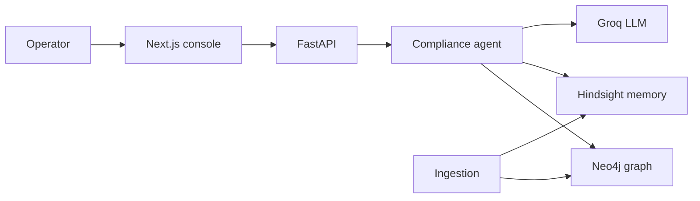

# VeriChron AI

**Bitemporal Governance & Audit Intelligence**

VeriChron AI does not just tell you what your compliance status is.

It reconstructs what your compliance status **was**, what the organization **knew** at that time, and **why** the status changed.

This is a desktop-first enterprise console (Next.js + FastAPI) with:

- Bitemporal facts (`valid_*` vs `system_*`)
- Neo4j for explicit compliance relationships
- Hindsight for long-term memory (`retain` / `recall` / `reflect` / `create_mental_model`)
- Groq for reasoning (`openai/gpt-oss-120b`, `qwen/qwen3-32b`)
- A deterministic **demo mode** so judges can run the full product with no external systems



## 30-second demo

1. Open [http://localhost:3000](http://localhost:3000) — **Compliance Overview** (92% SOC 2, gap matrix).
2. **Settings** → ingest the sample note (Act 1: graph + `retain()`).
3. **Audit Assistant** → `Find unresolved compliance gaps.` (Act 2).
4. **Time machine** → set **15 May 2025** → **Reconstruct state** (Act 3, climax).
5. Ask: `What was our compliance posture on May 15, 2025?`

On 15 May 2025 **valid time**, MFA was already off (IAM change 12 April). On 15 May 2025 **system time**, CloudTrail is known, but the May 20 control test, June finding, and 15 July policy upload are **not** leaked into the reconstruction.

## Quick start

### Docker

```bash
docker compose up --build
```

- UI: http://localhost:3000  
- API: http://localhost:8000/docs  
- Neo4j browser: http://localhost:7474 (`neo4j` / `password`)

`DEMO_MODE=true` (default) serves a complete in-memory graph and memory bank. Neo4j still starts so you can seed it later.

### Local (no Docker)

```bash
# backend
cd backend
python -m venv .venv
.venv\Scripts\activate
pip install -r requirements.txt
uvicorn app.main:app --reload --port 8000

# frontend
cd frontend
npm install
npm run dev
```

Copy `.env.example` to `.env`. Never commit secrets.

## Architecture

See [docs/architecture.md](docs/architecture.md).

| Store | Responsibility |
| --- | --- |
| Neo4j | Typed edges: `GOVERNS`, `SATISFIED_BY`, `EVIDENCED_BY`, `VIOLATES`, `CAUSES`, … |
| Hindsight | Raw facts, observations, mental models, temporal recall/reflect |
| Groq | Intent + grounded JSON assessment |

The UI talks only to FastAPI. Services are swapped behind:

- `MockNeo4jService` / `RealNeo4jService`
- `MockHindsightService` / `RealHindsightService`
- `MockLLMService` / `RealGroqService`

## Agent pipeline

User question → intent → temporal extraction → Neo4j → Hindsight `recall()` → evidence fusion → `reflect()` → LLM → compliance assessment.

Historical queries filter **both** valid time and system time. Future-known artifacts are excluded.

## Demo narrative (CC6.1)

| When | World (valid) | Known (system) |
| --- | --- | --- |
| Jan 2025 | MFA active | Okta export 8 Jan |
| 12 Apr 2025 | IAM MFA condition removed | CloudTrail same day |
| 15 May 2025 | Still non-compliant | Test/finding **not yet** |
| 20 May 2025 | Control test FAIL | GRC records FAIL |
| 3 Jun 2025 | Finding open | Audit memo |
| 8 Jul 2025 | Remediated | Jira done + retest |
| 15 Jul 2025 | Policy had been valid since Jan | Policy PDF first retained |

## API

| Method | Path |
| --- | --- |
| POST | `/api/ingest` |
| POST | `/api/query` |
| POST | `/api/audit/reconstruct` |
| POST | `/api/compliance/analyze` |
| GET | `/api/controls` `/api/findings` `/api/evidence` `/api/timeline` |
| GET | `/api/graph/{entity_id}` |
| GET | `/api/mental-models` |
| POST | `/api/mental-models/{id}/refresh` |
| GET | `/api/agent-runs` |

## Production vs demo

Set `DEMO_MODE=false` when Neo4j and Hindsight are reachable. If they fail health checks, the factory keeps mock implementations so the console never goes blank.

Rotate any API keys that were pasted into chat or screenshots.
