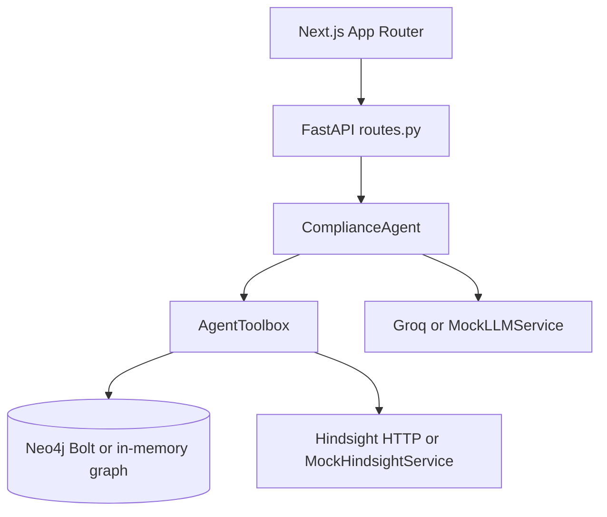

# 02 — System architecture

## Request path (actual)

```
Next.js UI (localhost:3000)
  → FastAPI (localhost:8000)  CORS allow *
    → ComplianceAgent
      → AgentToolbox
        → Neo4jService (live Bolt or MockNeo4jService)
        → HindsightService (HTTP if healthy else MockHindsightService)
        → LLMService.reason (Groq or mock) after tools
    → JSON AgentAnswer or SSE events
```

Hindsight is **not** a Compose service. If `HINDSIGHT_URL` (default `http://localhost:8888`) is down, health shows `hindsight: disconnected` and retain/recall use the **in-process mock bank**.

## Components

| Component | Path | Responsibility |
| --- | --- | --- |
| AppShell | `frontend/src/components/AppShell.tsx` | Nav, command palette, health strip |
| API client | `frontend/src/lib/api.ts` | `fetch` / SSE to `NEXT_PUBLIC_API_URL` |
| FastAPI app | `backend/app/main.py` | Lifespan: `build_services()`, `seed_graph()`, `seed_hindsight()` |
| Routes | `backend/app/api/routes.py` | All HTTP endpoints |
| Factory | `backend/app/services/factory.py` | Probe Groq, Neo4j, Hindsight |
| Agent | `backend/app/agents/pipeline.py` | Tool plan + reason |
| Tools | `backend/app/agents/tools.py` | Eight named tools |
| ACME data | `backend/app/data/acme.py` | Seed graph, memories, lists |
| Schema | `neo4j/schema.cypher` | Constraints + indexes |



See also `diagrams/system-architecture.md`.
