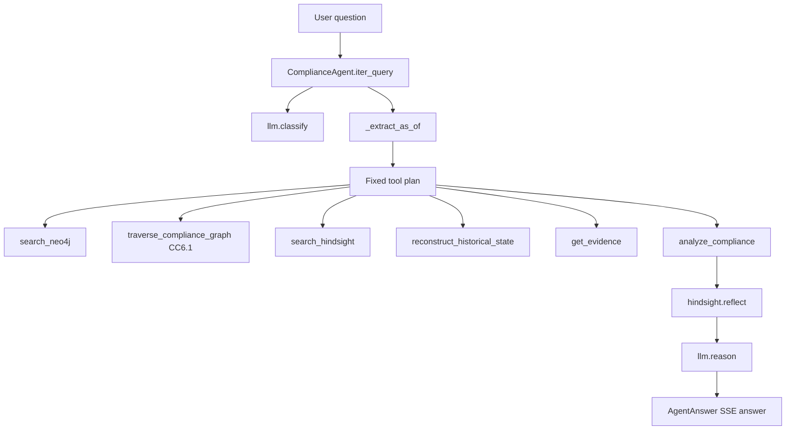

# 03 — Agent architecture

Implementation lives in `backend/app/agents/pipeline.py` (`ComplianceAgent`) and `backend/app/agents/tools.py` (`AgentToolbox`, `GROQ_TOOLS`).

## Entry points

| Function | Used by |
| --- | --- |
| `query(question, valid_as_of, system_as_of)` | `POST /api/query` |
| `iter_query(...)` | `POST /api/query/stream` (SSE) |
| `reconstruct(req: ReconstructRequest)` | `POST /api/audit/reconstruct` |

## Actual execution (do not invent LLM planning)

`iter_query` does **not** ask Groq to pick tools. Comments in `pipeline.py` state Groq is used for the final grounded write, not to block the loop. `GROQ_TOOLS` exists in `tools.py` but **`iter_query` never calls `run_tool_loop`**.

SSE event types: `run`, `thought`, `tool_start`, `tool_end`, `answer`, `done`.

1. Yield `thought` (will use tools).
2. `llm.classify(question)` for intent / optional `temporal_as_of`.
3. `_extract_as_of` (May 15 / June 25 / July 15 / April 10) if request dates omitted.
4. Yield temporal `thought`.
5. Run a **fixed six-step `plan`**.
6. Call `hindsight.reflect` (not an `AgentToolbox` method; SSE name `hindsight.reflect`).
7. `llm.reason(...)` once.
8. Build `AgentAnswer` (`conclusion`, `compliance_status`, `evidence`, `timeline`, `caveat`, `run`).
9. Yield `answer` then `done`.

## System prompt

`SYSTEM_PROMPT` lives in `backend/app/services/llm_service.py` (not the agent file). Used as the Groq system message in `RealGroqService.reason`. It describes VeriChron as a bitemporal compliance auditor. The agent itself streams canned `thought` strings from `iter_query`.

## State

No LangGraph / checkpoint. Per-request: `stages: list[AgentStage]`, `traces: list[dict]`, `run_id`. `self.runs` keeps the last 50 `AgentRun` objects; `self.run_index` stores richer tool I/O for `GET /api/agent/runs/{id}`.

## Temporal extraction

`_extract_as_of` in `pipeline.py`: substring match for `may 15` → 2025-05-15, `june 25`, `july 15`, `april 10`. Default fallback `2025-07-15`. `QueryRequest.valid_as_of` overrides. If `system_as_of` is omitted, it is set equal to valid time.

## Tool plan (hardcoded in `iter_query`)

```
search_neo4j(query=question, valid_as_of, system_as_of)
traverse_compliance_graph(start_id=CC6.1)
search_hindsight(...)
reconstruct_historical_state(as_of=valid_as_of)
get_evidence(system_as_of)
analyze_compliance(question, as_of)
hindsight.reflect(query)   # service call, not GROQ_TOOLS
```

`get_entity` exists on the toolbox but is **not** in this plan.

## Memory / graph / fusion

- Graph: `search_neo4j` + `traverse_compliance_graph` recorded in traces; path passed into `llm.reason` as `path`.
- Memory: `search_hindsight` plus `hindsight.reflect`.
- Fusion into Groq is a **context dict** (`intent`, dates, `analysis`, `reconstruct` subset, `reflection`, `path`) — not a vector store.

## Final response

`AgentAnswer` in `schemas.py`: `conclusion`, `compliance_status`, `affected_controls`, `evidence`, `timeline`, `root_cause`, `remediation`, `confidence`, `sources`, `graph_path`, `known_at_query_time`, `caveat`, `run`.


