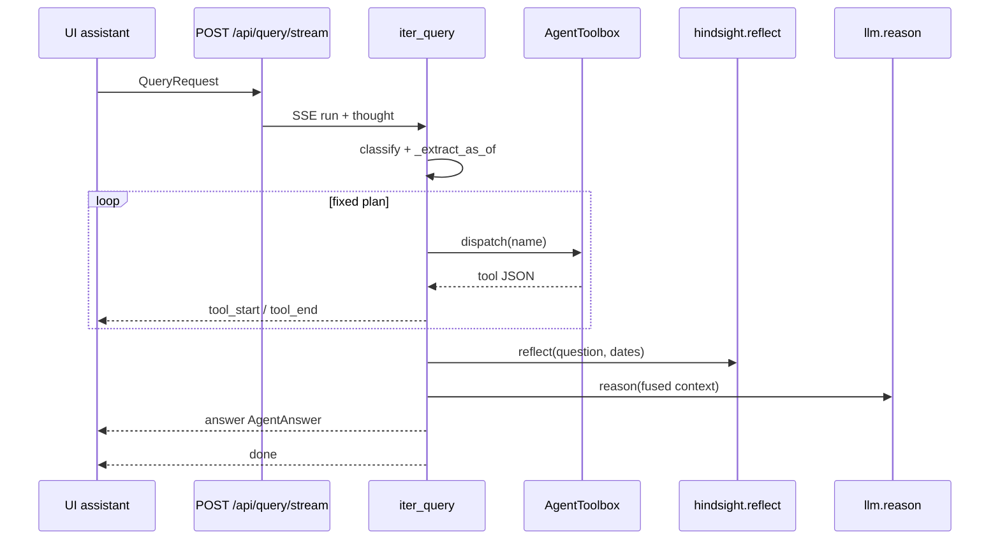

# Diagram: agent execution

```mermaid
sequenceDiagram
  participant U as UI assistant
  participant S as POST /api/query/stream
  participant A as iter_query
  participant T as AgentToolbox
  participant H as hindsight.reflect
  participant L as llm.reason
  U->>S: QueryRequest
  S->>A: SSE run + thought
  A->>A: classify + _extract_as_of
  loop fixed plan
    A->>T: dispatch(name)
    T-->>A: tool JSON
    A-->>U: tool_start / tool_end
  end
  A->>H: reflect(question, dates)
  A->>L: reason(fused context)
  A-->>U: answer AgentAnswer
  A-->>U: done
```
