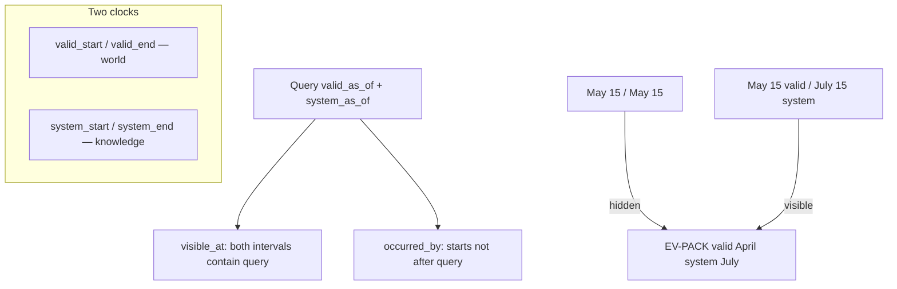

# Diagram: bitemporal model

```mermaid
flowchart TB
  subgraph clocks [Two clocks]
    V[valid_start / valid_end — world]
    S[system_start / system_end — knowledge]
  end
  Q[Query valid_as_of + system_as_of]
  VA[visible_at: both intervals contain query]
  OB[occurred_by: starts not after query]
  Q --> VA
  Q --> OB
  PACK[EV-PACK valid April system July]
  MAY[May 15 / May 15]
  MAY -->|hidden| PACK
  JUL[May 15 valid / July 15 system]
  JUL -->|visible| PACK
```
