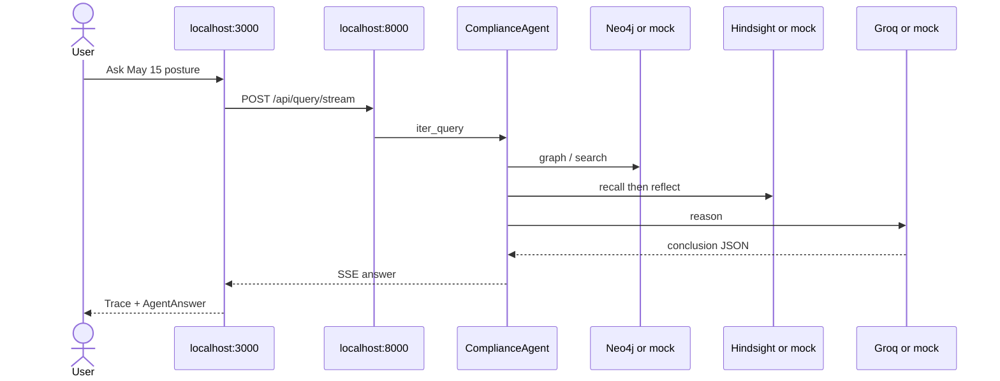

# Diagram: end-to-end request

```mermaid
sequenceDiagram
  actor User
  participant Next as localhost:3000
  participant Fast as localhost:8000
  participant Agent as ComplianceAgent
  participant Neo as Neo4j or mock
  participant Hind as Hindsight or mock
  participant Groq as Groq or mock
  User->>Next: Ask May 15 posture
  Next->>Fast: POST /api/query/stream
  Fast->>Agent: iter_query
  Agent->>Neo: graph / search
  Agent->>Hind: recall then reflect
  Agent->>Groq: reason
  Groq-->>Agent: conclusion JSON
  Agent-->>Next: SSE answer
  Next-->>User: Trace + AgentAnswer
```
