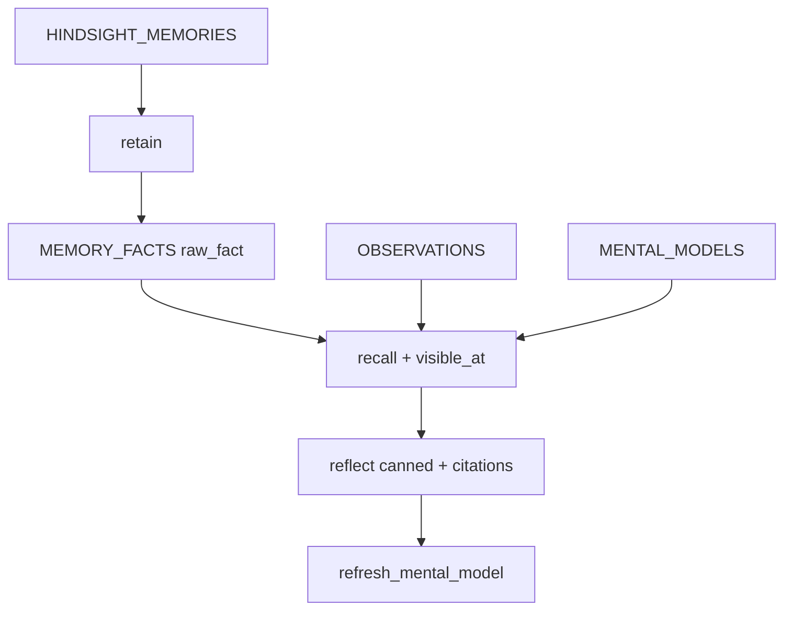

# Diagram: Hindsight memory flow

```mermaid
flowchart TD
  Seed[HINDSIGHT_MEMORIES]
  Retain[retain]
  Facts[MEMORY_FACTS raw_fact]
  Rec[recall + visible_at]
  Obs[OBSERVATIONS]
  MM[MENTAL_MODELS]
  Ref[reflect canned + citations]
  Seed --> Retain --> Facts
  Facts --> Rec
  Obs --> Rec
  MM --> Rec
  Rec --> Ref
  Ref --> MMRefresh[refresh_mental_model]
```

Live optional: `POST /v1/banks/verichron-compliance/recall|reflect`.
