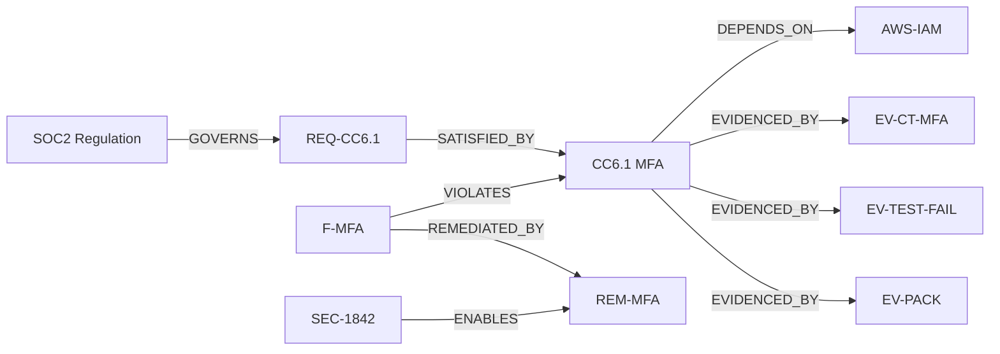

# Diagram: Neo4j ACME graph (seed)

```mermaid
flowchart LR
  SOC2[SOC2 Regulation]
  R61[REQ-CC6.1]
  C61[CC6.1 MFA]
  IAM[AWS-IAM]
  CT[EV-CT-MFA]
  FAIL[EV-TEST-FAIL]
  FIND[F-MFA]
  JIRA[SEC-1842]
  REM[REM-MFA]
  PACK[EV-PACK]
  SOC2 -->|GOVERNS| R61
  R61 -->|SATISFIED_BY| C61
  C61 -->|DEPENDS_ON| IAM
  C61 -->|EVIDENCED_BY| CT
  C61 -->|EVIDENCED_BY| FAIL
  C61 -->|EVIDENCED_BY| PACK
  FIND -->|VIOLATES| C61
  FIND -->|REMEDIATED_BY| REM
  JIRA -->|ENABLES| REM
```

Also in seed: PAM, QAR, SEC-MON, F-PAM, F-UAR, policies, `org:acme`, `person:priya`.
