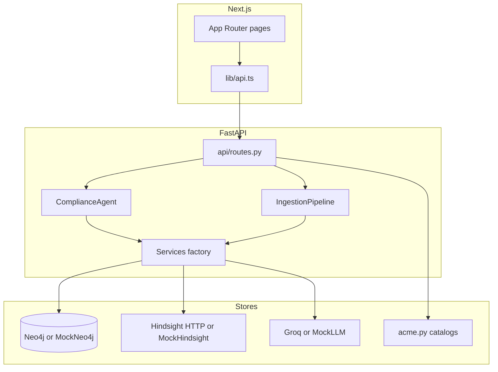

# Diagram: system architecture

```mermaid
flowchart TB
  subgraph ui [Next.js]
    Pages[App Router pages]
    APIClient[lib/api.ts]
  end
  subgraph api [FastAPI]
    Routes[api/routes.py]
    Agent[ComplianceAgent]
    Ingest[IngestionPipeline]
    Factory[Services factory]
  end
  subgraph stores [Stores]
    N[(Neo4j or MockNeo4j)]
    H[Hindsight HTTP or MockHindsight]
    L[Groq or MockLLM]
    D[acme.py catalogs]
  end
  Pages --> APIClient --> Routes
  Routes --> Agent
  Routes --> Ingest
  Routes --> D
  Agent --> Factory
  Ingest --> Factory
  Factory --> N
  Factory --> H
  Factory --> L
```

Compose processes: `verichron-neo4j`, `verichron-backend`, `verichron-frontend` only.
