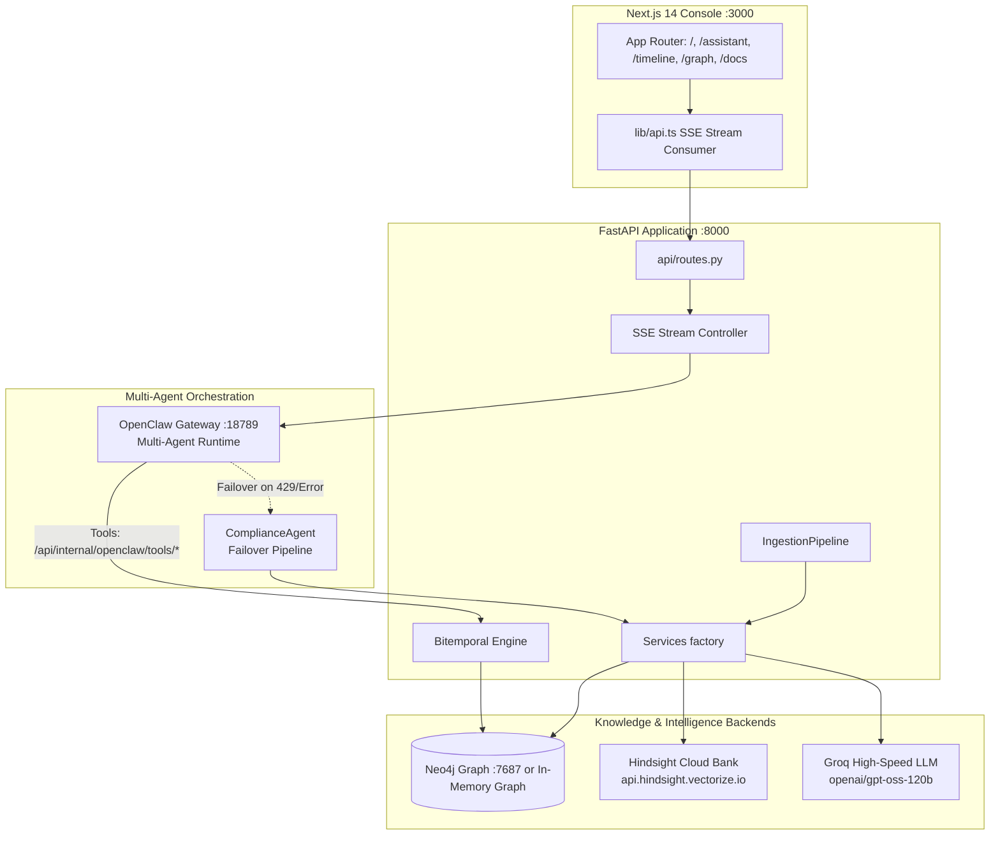

# Diagram: system architecture

```mermaid
flowchart TB
  subgraph ui [Next.js 14 Console :3000]
    Pages[App Router: /, /assistant, /timeline, /graph, /docs]
    APIClient[lib/api.ts SSE Stream Consumer]
  end

  subgraph api [FastAPI Application :8000]
    Routes[api/routes.py]
    StreamHandler[SSE Stream Controller]
    Ingest[IngestionPipeline]
    Engine[Bitemporal Engine]
    Factory[Services factory]
  end

  subgraph orchestrators [Multi-Agent Orchestration]
    OpenClaw[OpenClaw Gateway :18789\nMulti-Agent Runtime]
    Agent[ComplianceAgent\nFailover Pipeline]
  end

  subgraph stores [Knowledge & Intelligence Backends]
    N[(Neo4j Graph :7687 or In-Memory Graph)]
    H[Hindsight Cloud Bank\napi.hindsight.vectorize.io]
    L[Groq High-Speed LLM\nopenai/gpt-oss-120b]
  end

  Pages --> APIClient --> Routes
  Routes --> StreamHandler
  StreamHandler --> OpenClaw
  OpenClaw -.->|Failover on 429/Error| Agent
  OpenClaw -->|Tools: /api/internal/openclaw/tools/*| Engine
  Agent --> Factory
  Ingest --> Factory
  Engine --> N
  Factory --> N
  Factory --> H
  Factory --> L
```

Docker Compose services: `verichron-neo4j`, `verichron-backend`, `verichron-frontend` (with optional `docker-compose.openclaw.yml`).

